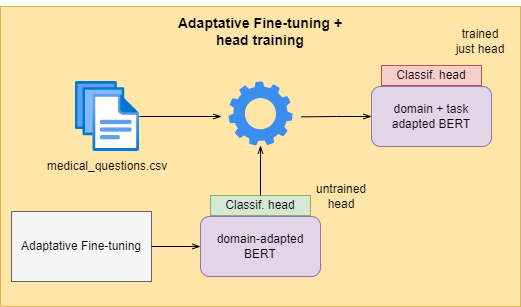

# Fine-tuning MLMs 🤖⚙️

This brief research is intended to explore the different fine-tuning approaches that can be applied for adapting bert-like MLMs to a custom domain datasets.

<figure>
  
  
  <figcaption style='text-align:center';>
  Framework for fine-tuning LMs. 
  <a href="https://ruder.io/recent-advances-lm-fine-tuning/">Sebastian Rude's post</a>
  </figcaption>
</figure>

## 1. Technical context
Let's make a very quick review of the different techniques we want to test:

1. **Base model training**: We will use a pretrained language model as an embedding generator. A simple FC layer will be trained for a classification task.

2. **Adaptative fine-tuning (augmented pre-training)**: Pretrained LM are robust in terms of o.o.d generalization. However, they still suffer when dealing with data belonging to an unseen domain. This training method involves fine-tuning the model so it can be adapted to a desired (new) domain.
    
    This is done using the same objectives as in the pre-training phase: **MLM** and **NSP** (BERT). This technique is useful to generate models when high performance is needed in a set of tasks within a specific data domain.

3. **Behavioural fine-tuning (task fine-tuning)**: This technique focus on addapting a model to a specific task. To do this, labeled data is required. In this set-up, the encoder's weights are unfreezed so the whole base model is trained along with the FC layer. Another option is to perform a previous step in which the model is trained with task-specific data related to the final objective.

For a wider explanation, please visit [Sebastian Ruder's amazing blog post](https://ruder.io/recent-advances-lm-fine-tuning/)

## 2. Hypothesis
Adaptative fine-tuning outperforms base model training. Behavioural fine-tuning outperforms adaptative fine-tuning. Adaptative + behavioural fine-tuning will achieve the best results.

## 3. Methodology
For conducting the experiments, proper dataset/task needs to be selected. The data needs to be different enough (in terms of domain) so the adaptation becomes a key aspect. Appart from that, we have to choose a base model and define the experiments, as well as define a set of metrics.

### 3.1. Dataset / Task
In order to properly test the influence of the fine-tuning method in the performance, we need to select a dataset (and a task) for which the adaptation plays a key rol. For example, selecting a very domain-specific dataset for solving sentiment analysis task might not be the best choice, since sentiment particles used to be not domain-related.

A good task for our case could be **Sentence Similarity classification**. In Sentence Similarity, the model needs to learn the semantics of the dataset so it can determine if both sentences are related or not. Working with this task allows us to use a dataset framed in a domain to which the model has not been exposed during the pre-training phase.

Taking that into consideration, the chosen dataset has been [medical_questions_pairs](https://huggingface.co/datasets/medical_questions_pairs). This dataset is composed by ~3K medical sentence pairs (questions). For each question, two different samples has been generated: 1) A reformulated sentence that entails with the original one. 2) A question not related with the original.

### 3.2. Metrics
Since we are using Semantic Similarity in a classification setup as our target task, we have selected the usual classification metrics for evaluating the different trainings: accuracy, F1 score.

### 3.3. Model
Selected [bert-base-cased](https://huggingface.co/bert-base-cased) as our backbone model. For accessing and training the model, HF transformers library is being used.

### 3.4. Experiment setup
Experiments will be conducted following this order.

1. First thing to do is to train our baseline. This is, freeze the encoder's weights and train just the FC layer on the classification task objective for a couple of epochs.

2. The second experiment is a test of **Behavioural fine-tuning**. This is the classic setup when fine-tuning a HF bert-like model. Just unfreeze backbone's weights and train them along with the FC layer for the task objective.

3. Next step, we performed **Adaptative fine-tuning**. In this phase, we trained the model with a ML objective (NSP will not be possible, since the dataset is composed by individual sentences). After that adaptation, a new version of the base encoder is generated. This time, taylored to our specifict semantic domain.

    

4. Once we have our custom encoder, it's time to repeat the previous experiments and see if we achieve better results. First of all, again a basic training of the classification head. We will freeze our new encoder's weights and just train the upper dense layers.

    

5. Last experiment consists on a mix of both techniques. After an initial phase of Adaptative fine-tuning objective, we perform **Behavioural fine-tuning**. In this setup, our custom backbone's weights are trained twice, first for adapting to the data domain and then to further understand the specific task.

    

## 4. Results

After training all different models, we can make a quick comparison. In the image below, you can see the accuracy metric evolution during the training process (8 epochs) for each experiment.

<figure>
  
</figure>

**NOTE: We are just using accuracy, since F1-score results were not precise enough to describe the differences.**

 

If we extract top performances from each run, the final results are as follows:

 

| Model       | Best Accuracy | Best epoch   |
| ----------- | -----------   |  ----------- |
| Baseline (Head train)                                     | 68.22        | 8          |
| Behavioural fine-tuning                                   | 82.24        | 4          |
| Adaptative fine-tuning + Head train                       | 69.63        | 5          |
| **Adaptative fine-tuning + Behavioural fine-tuning**      | **85.05**    | **5**      |

 

As we can see in the table above, the best result is achieved by mixing both Adaptative and Behavioural fine-tuning approaches.

**Keep in mind that performance differences are relatively low. This is due to the small dataset we are using. With larger datasets, the difference between strategies would be probably higher**. 